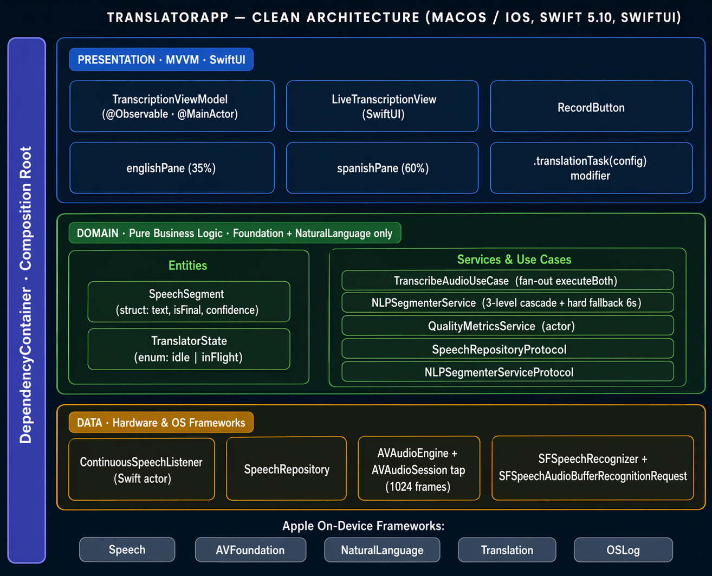

<p align="center">
  
</p>

# TranslatorApp

> Real-time, fully on-device English → Spanish live-captioning app for macOS and iOS. Built with SwiftUI, Swift Concurrency and Apple's on-device Speech + Translation frameworks.

[](https://swift.org)
[](https://developer.apple.com)
[](https://developer.apple.com/xcode/swiftui/)
[]()
[]()

---

## Table of Contents

- [Overview](#overview)
- [Why TranslatorApp](#why-translatorapp)
- [Features](#features)
- [Screenshots / Demo](#screenshots--demo)
- [Architecture](#architecture)
- [Tech Stack](#tech-stack)
- [Key Design Decisions](#key-design-decisions)
- [Segmentation Strategy](#segmentation-strategy)
- [Structured Logging](#structured-logging)
- [Getting Started](#getting-started)
- [Project Structure](#project-structure)
- [Known Gaps / Roadmap](#known-gaps--roadmap)
- [Learning Path](#learning-path)
- [License](#license)

---

## Overview

**TranslatorApp** is a native macOS / iOS application that continuously transcribes English speech (`en-US`) and displays the Spanish (`es-ES`) translation in real time, **completely offline**. No audio or text ever leaves the device.

It is designed as a simultaneous-comprehension assistant for classrooms, technical conferences and business meetings where a presenter speaks English and the audience needs to follow the discourse in Spanish.

## Why TranslatorApp

Existing live-translation solutions:
- Require a stable internet connection.
- Introduce variable latency.
- Expose potentially sensitive audio to third-party cloud services.

TranslatorApp removes all three constraints by relying exclusively on Apple's on-device models:

| Concern | Existing solutions | TranslatorApp |
| --- | --- | --- |
| Connectivity | Required | Not required |
| Latency | Variable (network) | **< 1 s** end-to-end |
| Privacy | Audio sent to cloud | **100 % on-device** |
| API costs | Per-minute or per-request | Zero |

## Features

- **Continuous live transcription** — partial ASR results stream into the English pane as the user speaks.
- **Intelligent phrase segmentation** — a 3-level cascade (NLTokenizer → clause cut → stability timer) plus a hard 6 s fallback feeds only stable, non-redundant phrases to the translator.
- **Fully offline translation** — Apple's `Translation` framework performs EN → ES translation on-device (iOS 17+ / macOS 14+).
- **Split-pane UI** — 35 % English / 60 % Spanish layout with auto-scroll in both panes.
- **Differential emit** — only the delta over already-committed text is ever translated; no duplicates, no re-translation.
- **Duplicate-guard on commit** — exact-match, subset and superset translations are filtered before rendering.
- **Quality metrics** — per-session tracking of ASR revision rate, stability delay, words/second, confidence and fragmentation (groundwork for adaptive tuning).
- **Structured logging via OSLog** — traceable end-to-end pipeline with prefixes like `[ASR-PARTIAL]`, `[BUFFER-FLUSH]`, `[COMMIT]`, `[TRANSLATE-START/DONE]`.
- **No singletons, no global state** — the entire dependency graph is composed in a single `DependencyContainer`.

## Screenshots / Demo

> _Add a GIF or a PNG here once you record one._
>
> Suggested capture: record a 30-second clip of a native English speaker while both panes fill in, then convert to GIF with `ffmpeg`.

## Architecture

The project implements **Clean Architecture** in three layers with **MVVM** in the presentation layer. The composition root is a single `DependencyContainer`; there are no singletons or global state.

```
┌──────────────────────────────────────────────────────────┐
│  PRESENTATION  ·  MVVM + SwiftUI                         │
│  TranscriptionViewModel · LiveTranscriptionView          │
│  RecordButton · englishPane · spanishPane                │
│  .translationTask(config) modifier                       │
├──────────────────────────────────────────────────────────┤
│  DOMAIN  ·  Pure business logic                          │
│  TranscribeAudioUseCase · NLPSegmenterService            │
│  QualityMetricsService (actor)                           │
│  SpeechSegment · TranslatorState                         │
│  SpeechRepositoryProtocol · NLPSegmenterServiceProtocol  │
├──────────────────────────────────────────────────────────┤
│  DATA  ·  Hardware & OS frameworks                       │
│  ContinuousSpeechListener (actor) · SpeechRepository     │
│  AVAudioEngine · SFSpeechRecognizer                      │
└──────────────────────────────────────────────────────────┘

Cross-cutting:
  DependencyContainer  (Composition Root)
  OSLog                (com.spanesso.TraslatorApp, per-component categories)
```

### Data Layer
- **`ContinuousSpeechListener`** (Swift `actor`) — wraps `SFSpeechRecognizer` and `AVAudioEngine`. Configures `AVAudioSession` (`.record`, `.measurement`, `duckOthers`), installs a 1024-frame tap on `inputNode`, and produces an `AsyncStream<SpeechSegment>` of partial + final ASR results. Records quality signals on every update.
- **`SpeechRepository`** — thin adapter implementing `SpeechRepositoryProtocol`, isolating the domain from the concrete Speech / AVFoundation dependencies.

### Domain Layer
- **`SpeechSegment`** — value type `{ text, isFinal, confidence }`; the atomic unit flowing through the pipeline.
- **`TranslatorState`** — enum `.idle | .inFlight` for the translator indicator.
- **`NLPSegmenterService`** — converts the continuous ASR stream into stable, translatable phrases via a 3-level cascade + hard 6 s fallback. Maintains `committedFullText` + `committedWordCount` so only the delta is ever emitted.
- **`QualityMetricsService`** (`actor`) — per-session revision rate, stability delay, words/second, confidence and fragmentation. Exposes `isLowQualitySpeech()` for future adaptive tuning.
- **`TranscribeAudioUseCase`** — orchestrates the pipeline. `executeBoth()` starts a single ASR session and **fans out** the source stream into two independent streams via a detached pump `Task` (required because `AsyncStream` is single-consumer).

### Presentation Layer
- **`TranscriptionViewModel`** (`@Observable`, `@MainActor`) — runs two concurrent Tasks:
  1. Updates `currentBuffer` from the raw ASR stream (the live, non-committed delta).
  2. Feeds stable phrases into `translationRequests: AsyncStream<String>` consumed by `.translationTask`.
- **`LiveTranscriptionView`** — `GeometryReader`-based split pane (35 % / 60 %). Uses `.translationTask(config)` to consume the phrase stream and call back `appendTranslation(_:)`. Rotates a `taskID: UUID` on session start to force SwiftUI to destroy the previous `.translationTask` subtree.
- **`RecordButton`** — standalone toggle with pulse animation.

## Tech Stack

| Framework | Role |
| --- | --- |
| **Swift 5.10** · **SwiftUI** | Language + UI (declarative) |
| **@Observable** (Observation) | Reactive state without Combine boilerplate |
| **Speech** (`SFSpeechRecognizer`) | On-device ASR in `en-US` |
| **AVFoundation** (`AVAudioEngine`, `AVAudioSession`) | Microphone capture + audio graph |
| **NaturalLanguage** (`NLTokenizer`) | Sentence-level tokenization for the segmenter |
| **Translation** (Apple) | Offline EN → ES neural translation |
| **Swift Concurrency** (actors, `AsyncStream`, `Task`) | Thread safety, backpressure, structured concurrency |
| **OSLog** | Structured, filterable logging per component |

Target platforms: **macOS 14+** and **iOS 17+** (required for the `Translation` framework).

## Key Design Decisions

1. **Single-consumer fan-out.** `AsyncStream` is single-consumer, so a `Task.detached` pump fans the source ASR stream into two independent `AsyncStream`s (raw + segmenter input). Iterating the same stream twice would deliver segments non-deterministically.
2. **Differential emit via `committedFullText` + word-count fallback.** The ASR emits the cumulative transcript from session start. The segmenter keeps `committedFullText` and extracts the pending suffix; if the ASR **revises** committed text, the exact-prefix match fails — a `committedWordCount`-based offset then drops the first N words, immune to character-level corrections.
3. **3-level cascade + hard 6 s fallback.** See [Segmentation Strategy](#segmentation-strategy). Guarantees that fluent speakers with no natural pauses never starve the translation pipeline.
4. **Translation engine lifecycle.** On recording start, `taskID` is first rotated to a new `UUID` (forcing SwiftUI to tear down the previous `.translationTask` subtree) **before** `translationConfig` is assigned. Assigning the config without rotating the ID would leave a stale task consuming the old stream.
5. **Duplicate-guard on commit.** `appendTranslation(_:)` drops any new translation that is identical to, contained within, or a superset of the last appended sentence.
6. **Actor isolation for shared mutable state.** `ContinuousSpeechListener` and `QualityMetricsService` are actors, guaranteeing serialized access to audio engine state and metric accumulators.
7. **No singletons.** `DependencyContainer` builds the full graph in `init()`. `TranslatorAppApp` holds a single `@State private var container` so the graph lives for the app session.

## Segmentation Strategy

| Level | Trigger | Behaviour | Use case |
| --- | --- | --- | --- |
| **1 — NLTokenizer** | `NLTokenizer(unit: .sentence)` | Emits all complete sentences except the last (which may still be growing) | Speaker uses natural punctuation |
| **2a — Terminator** | Text ends with `.!?` or `isFinal == true` | Immediate flush | ASR finalizes or speaker pauses with a period |
| **2b — Clause cut** | Pending tail > 15 words | Cut at the last clause marker (`,;:—`) or discourse connector (`and`, `but`, `so`, `because`…) | Long fluent clauses without terminators |
| **2c — Stability timer** | 0.7 s without text change | Emit the pending tail | Natural pause between sentences |
| **3 — Hard fallback** | Pending buffer age > 6 s | `forceEmit = true` regardless of punctuation | Lecturer speaking fluently for 6+ s with no markers |

Only the **delta** over `committedFullText` is ever emitted; the translation engine never sees the same context twice.

## Structured Logging

All components log with `OSLog`, subsystem `com.spanesso.TraslatorApp` and a per-component category (`Speech`, `UseCase`, `Segmenter`, `Quality`, `ViewModel`, `UI`). Filter by prefix in Console.app or the Xcode debugger:

| Prefix | Component | Meaning |
| --- | --- | --- |
| `[ASR-PARTIAL]` | `NLPSegmenterService` | Every partial ASR update (debug) |
| `[ASR-FINAL]` | `NLPSegmenterService` / `ViewModel` | ASR confirms text as final (info) |
| `[BUFFER-APPEND]` | `TranscriptionViewModel` | Stable phrase arrived from segmenter |
| `[BUFFER-FLUSH reason=…]` | `NLPSegmenterService` | Phrase emission; reason ∈ `sentence \| terminator \| final \| silence \| wordcount \| timeout \| flush` |
| `[COMMIT id=N text=…]` | `NLPSegmenterService` + `ViewModel` | Committed text with incremental ID for tracing |
| `[TRANSLATE-START id=N]` | `LiveTranscriptionView` | Translation request sent to Apple engine |
| `[TRANSLATE-DONE id=N ms=X]` | `LiveTranscriptionView` | Translation completed with duration |

## Getting Started

### Requirements
- Xcode 15.3 or newer
- macOS 14+ (Sonoma) and/or iOS 17+
- Microphone and Speech Recognition permissions granted at runtime
- **First run only:** the OS downloads the offline translation model for `en → es` (one-time, a few MB)

### Clone & open

```bash
git clone https://github.com/<your-user>/swift-app-traslator.git
cd swift-app-traslator
open TranslatorApp.xcodeproj
```

### Build & run from the CLI

```bash
# Build
xcodebuild -project TranslatorApp.xcodeproj \
           -scheme TranslatorApp \
           -destination 'platform=macOS' build

# Run tests
xcodebuild test -project TranslatorApp.xcodeproj \
                -scheme TranslatorApp \
                -destination 'platform=macOS'

# Run a single UI test
xcodebuild test -project TranslatorApp.xcodeproj \
                -scheme TranslatorApp \
                -destination 'platform=macOS' \
                -only-testing:TranslatorAppUITests/TranslatorAppUITests
```

### Info.plist keys

The app requires:
- `NSMicrophoneUsageDescription`
- `NSSpeechRecognitionUsageDescription`

## Project Structure

```
TranslatorApp/
├── App/
│   ├── TranslatorAppApp.swift        # @main, owns DependencyContainer as @State
│   └── DependencyContainer.swift     # Composition root
├── Data/
│   ├── ContinuousSpeechListener.swift
│   └── SpeechRepository.swift
├── Domain/
│   ├── Entities/
│   │   ├── SpeechSegment.swift
│   │   └── TranslatorState.swift
│   ├── Protocols/
│   │   ├── SpeechRepositoryProtocol.swift
│   │   └── NLPSegmenterServiceProtocol.swift
│   ├── Services/
│   │   ├── NLPSegmenterService.swift
│   │   └── QualityMetricsService.swift
│   └── UseCases/
│       └── TranscribeAudioUseCase.swift
└── Presentation/
    ├── ViewModels/
    │   └── TranscriptionViewModel.swift
    └── Views/
        ├── LiveTranscriptionView.swift
        └── RecordButton.swift
```

## Known Gaps / Roadmap

- [ ] **Language picker** — the pair is currently hardcoded to `en-US → es-ES` in both `ContinuousSpeechListener` and `LiveTranscriptionView`.
- [ ] **Adaptive `stabilityDelay`** — `QualityMetricsService.isLowQualitySpeech()` is computed but not yet consumed.
- [ ] **Phrase deduplication via hashing** — `CryptoKit` is imported in `NLPSegmenterService` but unused.
- [ ] **Session persistence** — transcripts are in-memory only.
- [ ] **Multi-speaker diarization**.
- [ ] **Export to PDF / plain text**.
- [ ] **Real UI tests** — `TranslatorAppUITests` is currently scaffolding only.

## Learning Path

If you are studying this project to learn modern Swift, the technical document in [`specs/001-improve-transcription-translation/TranslatorApp_DocumentoTecnico.docx`](specs/001-improve-transcription-translation/) ships with a full syllabus covering:

- **Basics** — types, collections, optionals, structs / classes / enums, protocols.
- **Modern Swift** — ARC + retain cycles, `async/await`, `Task`, `Task.detached`, actors, `@MainActor`, `AsyncStream`, `@Observable`, SwiftUI advanced (`GeometryReader`, `.id()`, `.onChange`).
- **Frameworks** — `AVFoundation`, `Speech`, `NaturalLanguage`, `Translation`, `OSLog`.
- **Architecture** — Clean Architecture in iOS, MVVM + Observation, fan-out of `AsyncStream`, cooperative cancellation, backpressure.

Each topic is cross-referenced to the exact file and construct in the codebase.

## License

_Choose one (MIT recommended for this project) and add a `LICENSE` file._

```
Copyright (c) 2026 Sebastian Panesso
```

---

Built with ❤️ in Swift, offline by design.
